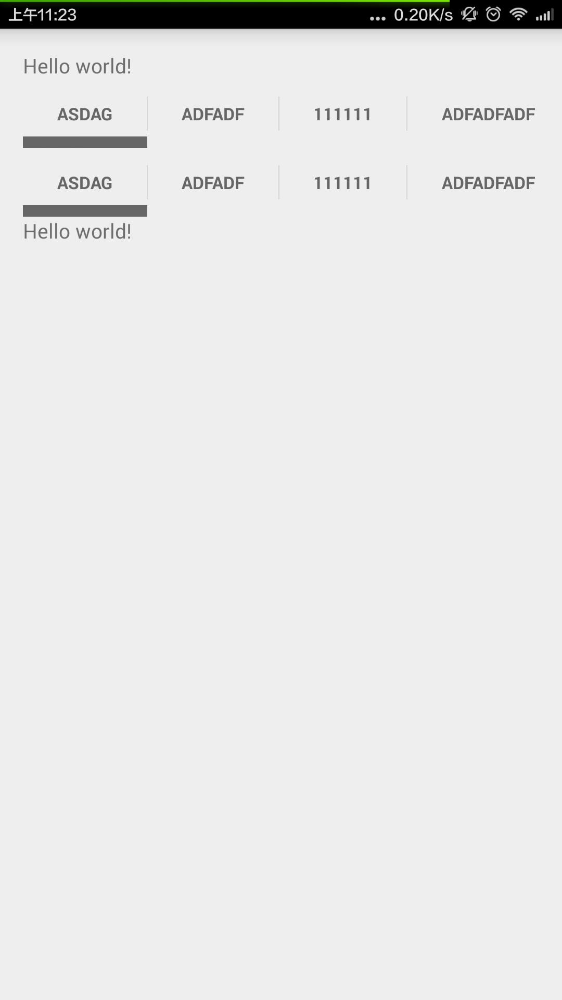

ImitateTabsView
===============
An Android library that imitate [PagerSlidingTabStrip](https://github.com/astuetz/PagerSlidingTabStrip),
use it without `ViewPager`.

# Usage

Please see the `sample/` folder for a working implementation.

1. Include the personal Maven repositories in your project's build.gradle.

        repositories {
            jcenter()
        }

2. Add the dependency in your module's build.gradle.

        dependencies {
            compile 'com.sumy:imitatetabsview:0.0.1'
        }

3. Include the ImitateTabsView widget in your layout.

        <com.sumy.imitatetabsview.ImitateTabsView
            android:id="@+id/tabview"
            android:layout_width="match_parent"
            android:layout_height="48dp" />

4. In your `onCreate` method (or `onCreateView` for a fragment), bind the widget with tab data.

        // Initialize the ImitateTabsView
        ImitateTabsView view = (ImitateTabsView) findViewById(R.id.tabview);
        // Set tab data
        view.addAllTabs(new String[]{"a", "b", "c"});

5. Set `OnTabItemClickListener` to receive the tabs click event.

        view.setOnTabItemClickListener(new ImitateTabsView.OnTabItemClickListener() {
            @Override
            public void onItemClick(int position) {
                // ...
            }
        });

# Customization

~~Not Support Yet~~

# Changelog

### Current Version: 0.0.1

# Developed By

 * sumy - <sunmingjian8@gmail.com>

# License

    Copyright 2013 Andreas Stuetz

    Licensed under the Apache License, Version 2.0 (the "License");
    you may not use this file except in compliance with the License.
    You may obtain a copy of the License at

       http://www.apache.org/licenses/LICENSE-2.0

    Unless required by applicable law or agreed to in writing, software
    distributed under the License is distributed on an "AS IS" BASIS,
    WITHOUT WARRANTIES OR CONDITIONS OF ANY KIND, either express or implied.
    See the License for the specific language governing permissions and
    limitations under the License.